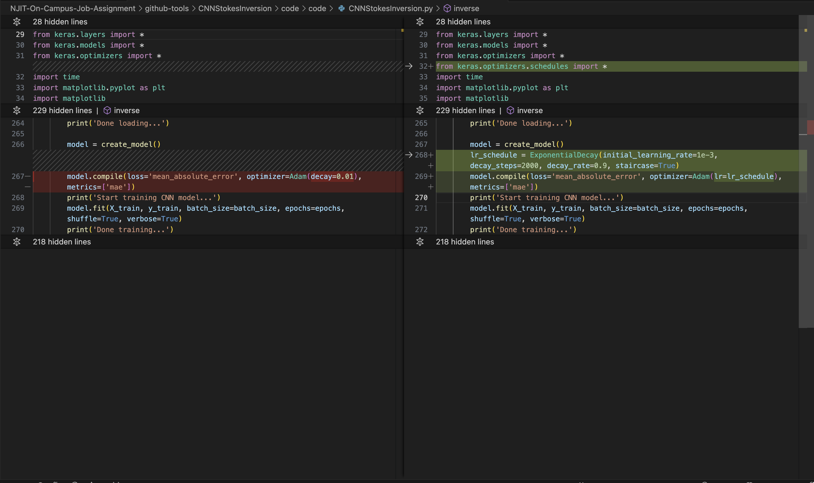

# CHANGELOG (12 Feb 2024)

## System configuration

* Hardware - Apple M2 Pro Chip
* OS - MacOS 14.3
* Python version - v3.11.7
* Pip - v23.3.1

## Package Versions

1. tensorflow==2.15.0
2. keras==2.15.0
3. numpy==1.26.4
4. pandas==2.2.0
5. scikit-learn==1.4.0
6. pyarrow==15.0.0

## Code Change

1. CNNStokesInversion.py
    
